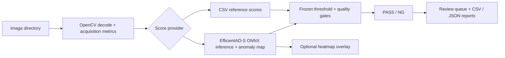

# Industrial Vision Deployment Reliability

**C++ · OpenCV · ONNX Runtime · Industrial AI · AOI**

A reference C++ inference and inspection pipeline for industrial anomaly detection, with engineering checks for cross-runtime decisions and local latency. This is a research-backed portfolio implementation, not a qualified factory system.

這個專案展示影像解碼與品質量測、ONNX 異常檢測推論、固定閾值判定，以及複檢與報表輸出。碩士研究關注影像取得條件變化後，固定模型的漏檢風險與有限人工複檢所能提供的證據。

## What it does

The inspector accepts an image directory, records acquisition metrics, obtains an anomaly score from a provider, applies a configured threshold, and writes PASS/NG and review reports. The EfficientAD-S provider performs preprocessing, ONNX Runtime inference, anomaly-map postprocessing, and an optional heatmap overlay. A CSV provider supports an independent software smoke test without model weights.



## Engineering validation

| Check | Verified result | Interpretation |
| --- | ---: | --- |
| Python ↔ C++ decision parity | **114 / 114** | Same saved EfficientAD-S model and frozen threshold; decision agreement, **not defect-detection accuracy** |
| Decision / score / map mismatches | **0 / 0 / 0** | Within the recorded parity tolerances |
| Local end-to-end CPU mean / p95 | **131.022 / 135.518 ms** | Apple M4, macOS arm64, sequential; includes visualization |
| Local throughput | **7.632 images/s** | 114 distinct images, five warmups, two measured passes, batch size one |

The original local checkout recorded three passing test entries, including model-backed parity tests. A public clean clone runs the model-free core test. See [results](results/) and [reproducibility](docs/reproducibility.md) for the exact boundaries.

## Example output

One local EfficientAD-S research batch at its frozen threshold produced **48 PASS, 66 NG, and 72 review-queue records** across 114 distinct images. This aggregate is included in [batch_summary.json](results/batch_summary.json); no dataset images or model are redistributed. The two images in `demo/sample/` are **self-generated synthetic inputs** for a CSV software smoke test. Their assigned scores are fabricated and carry no detection-performance meaning.

## Research context

The related master's research asks how a frozen industrial anomaly detector behaves when image acquisition conditions change. Even among predicted-PASS items, hidden defects can remain. It examines whether limited human review gives enough evidence for a deployment decision. A post-seal conceptual synthesis organizes this as PASS yield → review capacity → ranking → finite-evidence identifiability; that sequence was not a pre-specified four-stage experiment. Sealed Fabric and Rice evaluations primarily showed capacity-limited regimes; a single Real-IAD cross-view evaluation exposed a zero-PASS operating-point boundary. The theoretical result is conditional on explicit assumptions. See [research context](docs/research_context.md).

## Build

Install CMake, a C++17 compiler, OpenCV development libraries, and the ONNX Runtime C/C++ SDK separately. Third-party binaries and model weights are not included. From the repository root:

```sh
cmake -S demo -B build -DCMAKE_BUILD_TYPE=Release \
  -DOpenCV_DIR=/path/to/opencv/lib/cmake/opencv4 \
  -DONNXRUNTIME_ROOT=/path/to/onnxruntime-sdk
cmake --build build -j 4
ctest --test-dir build --output-on-failure
```

`OpenCV_DIR` can be omitted when CMake can find your installed OpenCV. For ONNX inference, obtain a compatible model separately, edit `model_path` in `demo/configs/efficientad_sheet.conf`, and verify its model SHA and preprocessing contract before use. The public repository cannot reproduce the recorded parity result without the original model and data.

## Run

The model-free CSV smoke test exercises decode, metrics, threshold decisions, and report writing:

```sh
./build/aoi_demo --config demo/configs/synthetic_csv.conf \
  --input demo/sample --scores demo/sample/scores.csv \
  --image-root demo/sample --output build/sample_run
```

For a separately obtained compatible ONNX model and licensed input images:

```sh
./build/aoi_demo --config demo/configs/efficientad_sheet.conf \
  --input /path/to/licensed-images --output build/inspection_run
```

## Repository structure

- `demo/src`, `demo/include`, `demo/tests`: C++17 pipeline and core tests
- `demo/configs`, `demo/sample`: reference configuration and synthetic smoke inputs
- `results`: sanitized summaries from verified local artifacts
- `docs`: project scope, research boundary, and reproducibility notes

## Scope and limitations

This is a reference implementation, not a real factory deployment or a semiconductor fab validation. The public sample is synthetic. The work evaluates deployment reliability; it does not introduce a new anomaly detector. The EfficientAD-S local model is separate from the thesis PatchCore configuration. Parity measures cross-runtime consistency, while latency is local CPU characterization. The reported external research findings have narrow evidence boundaries; no safe production release decision is claimed. See [limitations](docs/limitations.md).

## About

Electronic engineering master's student in the artificial intelligence group, focused on Computer Vision / AI Algorithm engineering and reliable industrial vision deployment. No degree-completion or industry-deployment claim is made here.
